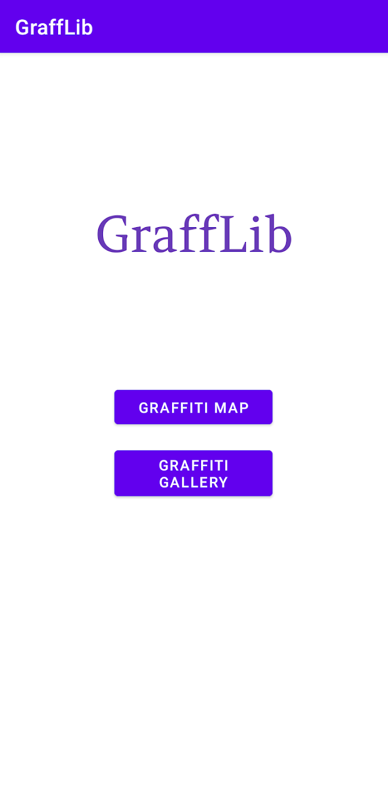
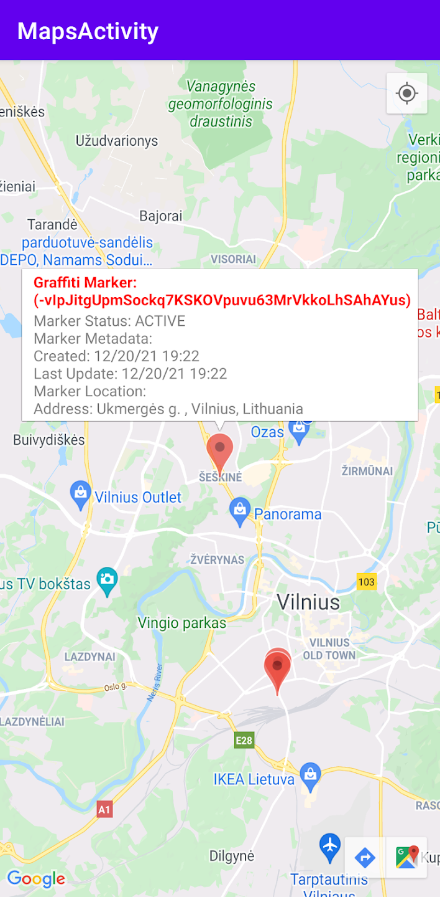
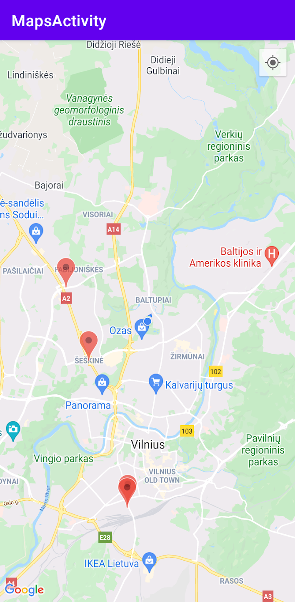
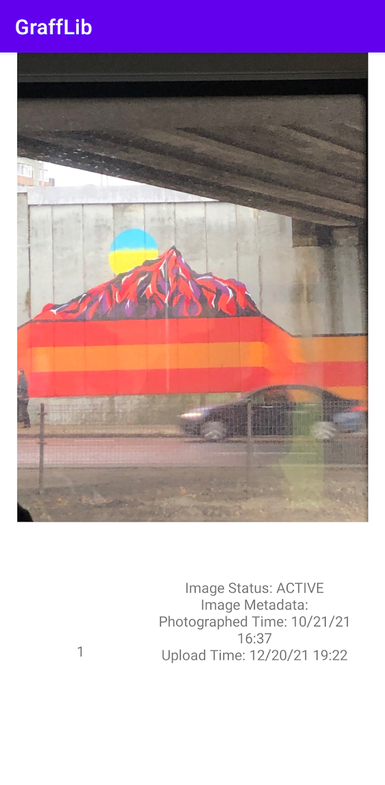

  <h2>GraffLib</h2>

## Jump to...

  - [Intro](#intro)
  - [Features](#features)
  - [Technologies](#technologies)
  - [Media](#media)

## Intro

GraffLib is a comprehensive application designed to catalog and explore graffiti art across urban environments. It serves as a temporal gallery and a tool for searching similar graffiti. With a combination of graffiti and library functionalities, GraffLib aims to capture the beauty and dynamics of graffiti in cities.

GraffLib offers a powerful Android application that allows users to interact with the platform on the go. The Android app provides a user-friendly interface to catalog, explore, and search for graffiti art. Users can take photos of graffiti, upload them to the platform, and mark their locations on the map. The app also supports viewing the temporal gallery, allowing users to see how graffiti spots evolve over time. Additionally, users can manage their profiles, view their contributions, and interact with other graffiti enthusiasts through the app.

The Restful API is a core component of GraffLib, enabling seamless integration with various platforms, including web, mobile, and desktop applications. The API provides endpoints for all major functionalities, such as graffiti cataloging, image uploads, and geographic data handling.

## Features
<ul>
  <li><b>Graffiti Cataloging:</b> Easily catalog graffiti art by taking photos and uploading them to the platform.</li>
  <li><b>Map Integration:</b> Mark the locations of graffiti on an interactive map, restricted to whitelisted cities.</li>
  <li><b>Temporal Gallery:</b> View the evolution of graffiti spots over time through a temporal gallery feature.</li>
  <li><b>Restful API:</b> Seamlessly integrate with various platforms using the provided Restful API.</li>
  <li><b>Security:</b> Ensure the security of uploaded content by scanning files and URLs for viruses using VirusTotal.</li>
  <li><b>Geocoding:</b> Convert addresses into geographic coordinates and vice versa using Nominatim.</li>
  <li><b>Water Body Identification:</b> Enhance the categorization of graffiti locations by identifying water bodies in images using the IsItWater API.</li>
</ul>

## Technologies 

| Technology Stack | Description |
| ---------------- | ----------- |
| **Python** | The core backend logic and data processing are implemented using Python, leveraging its extensive libraries and frameworks. |
| **Restful API** | The application provides a Restful API to facilitate seamless integration with various platforms, including web, mobile, and desktop applications. |
| **Flask** | A lightweight WSGI web application framework in Python, used to build the backend of the application. |
| **Swagger** | Integrated Swagger for API documentation, providing an interactive interface to explore and test the API endpoints. |
| **Docker** | Used to containerize the application, ensuring consistency across different environments and simplifying deployment. |
| **AWS Lightsail** | Previously used for hosting the application, providing a simple and cost-effective way to deploy and manage the application. |
| **Google Maps** | Integrated with Google Maps to allow users to mark graffiti images on the map, restricted to whitelisted cities. |
| **Android** | The front-end of the application is developed for the Android OS, providing a user-friendly interface for mobile users. |
| **Marshmallow** | A library for object serialization and deserialization, used to convert complex data types to and from Python data types. |
| **GeoAlchemy2** | An extension of SQLAlchemy, designed to support spatial databases like PostGIS, enabling advanced geographic queries and operations. |
| **PostgreSQL** | A robust and scalable relational database system used to store user data, markers, and metadata. |
| **PostGIS** | An extension of PostgreSQL that adds support for geographic objects, enabling spatial queries and GIS functionalities. |
| **Nominatim** | Utilized for geocoding and reverse geocoding, converting addresses into geographic coordinates and vice versa. |
| **VirusTotal** | A third-party API used to scan and analyze files and URLs for viruses, ensuring the security of uploaded content. |
| **IsItWater** | A third-party API that helps in identifying water bodies in images, enhancing the categorization of graffiti locations. |

## Media

