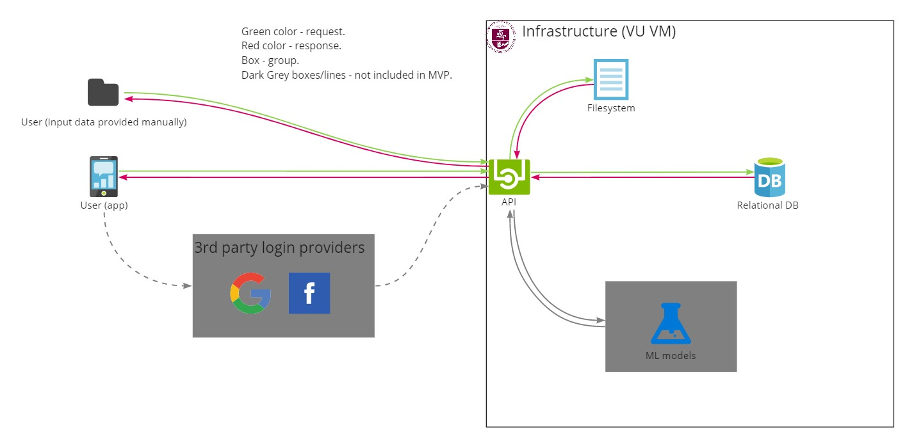

Table of Contents

- [Introduction](#introduction)
  - [Purpose](#purpose)
  - [Intended Audience](#intended-audience)
  - [Intended Use](#intended-use)
  - [Scope](#scope)
  - [Definitions and Acronyms](#definitions-and-acronyms)
- [Overall Description](#overall-description)
  - [User Needs](#user-needs)
  - [Assumptions and Dependencies](#assumptions-and-dependencies)
- [System Features and Requirements](#system-features-and-requirements)
	- [Functional Requirements](#functional-requirements)
  - [External Interface Requirements](#external-interface-requirements)
  - [System Features](#system-features)
	- [Non-Functional Requirements](#non-functional-requirements)	
		- [Performance and scalability](#performance-and-scalability)	
		- [Portability and compatibility](#portability-and-compatibility)	
		- [Reliability, Availability, Maintainability](#reliability-availability-maintainability)	
		- [Security](#security)
		- [Localization](#localization)
		- [Usability](#usability)
		- [Other](#other)	
- [Additional Information](#additional-information)
- [Changelog](#changelog)

---

## Introduction

This is the specification of requirements for GraffLib project. This is a software for sharing graffiti and it's information with people.

### Purpose

This is the document describing requirements for our GraffLib project. The purpose of this software is to allow sharing, analyzing and comparing of various graffities around a specific geographical location.

### Intended Audience

The Intended audience for this document is as follows:
- Project developers
- Problem-based-learning (PBL) curators and lecturers
- Vilnius University lecturers
- Other 3rd party persons

### Intended Use

The intended use of this document  is as follows:
- To describe project's requirements for various stakeholders.
- To track requirement changes as project progresses.
- Understand project's strengths and weaknesses when it comes to various software limitations.
- Have a good understanding of what our project will do and what it won't.

### Scope

Our goal is: ***to connect people who are interested in graffiti and enable them to share, analyze and compare pictures of graffiti online.*** 

Our system would:
- Save user data(accounts, passwords, emails, personal information).
- Save actual images.
- Save image meta-data(location, extensions, photography date, upload date).
- Save marker data (pins on the map).

Currently, there are no focus on front-end(GUI). We are primarily focused on back-end system.

We are thinking of hosting our system on Vilnius University's infrastructure.

### Definitions and Acronyms

| Acronym     | Definition  |
| ----------- | ----------- |
| API | Main part of our system where we are going to conduct save, analyze, compare and other functions. Definition link is here: [link](https://en.wikipedia.org/wiki/API). |
| Anonymous user | A user that is not logged on to the system. In our case, this user will only be able to view existing graffiti, and it's information, but not to upload them. |
| Geographical location | Geographical location of the graffiti - latitude and longitude. |
| GIS | A system that deals with real-life coordinates (latitude and longitude). Definition link is here: [link](https://en.wikipedia.org/wiki/Geographic_information_system). |
| Graffiti information | All information that is connected to a single graffiti image, such as location, upload time, user's description of it, relationship with the marker. |
| GraffLib | Project name|
| Graffiti/picture/image | Is writing or drawings made on a wall or other surface, usually without permission and within public view. Definition link is here: [link](https://en.wikipedia.org/wiki/Graffiti). |
| Infrastructure | Infrastructure (physical or virtual computers) where our system will be hosted on. In our case, it's Vilnius University's infrastructure(virtual machines). |
| Marker | A single point on a map where one or more graffiti images are located in real-life. The marker would contain not only the images, but statistics, such as how many images are on this marker. Example here: [link](https://risanb.com/code/colorful-google-maps-marker/default-marker.jpg). |
| Meta-data | Is "data that provides information about other data." Definition link is here: [link](https://en.wikipedia.org/wiki/Metadata). |
| Primary user | The primary user is in direct contact with the system interface and thus is usually most affected by it. Definition link is here: [link](https://medium.theuxblog.com/user-experience-primary-and-secondary-users-in-healthcare-8dd4c5c61490). |
| Problem-based-learning(PBL) | The Vilnius University's class name that we are building this project for. |
| Secondary user | Unlicensed user who always keeps track of activities of the primary user (administrator). Definition link is here: [link](https://www.igi-global.com/dictionary/secondary-user/46142). |
| User | A person that will use our system. |
| User information | User account information (username, password, email, user's graffiti information and etc.) |

 
This table is sorted in alphabetical order.
 

## Overall Description

### User Needs

Here are the project functions that we think our ***primary user*** will need the most:
- Upload the graffiti image.
- Display uploaded graffiti image.
- Aggregate different graffiti images around a single GIS marker.
- Analyze different graffiti images. This can be achieved either by some traditional algorithm, like comparing pixels, using machine vision or AI/ML algorithms.
- Compare different graffiti images over time.
- Allow the user to enter description about the particular image.
- Allow user to register, and log-in, recover an account.

Here are the project functions that we think our ***secondary user*** will need the most:
- Manage user accounts by deleting them or changing passwords and email addresses.
- Manage user data, such as images, markers, meta-data and other data.

Here are the project functions that we think our ***anonymous user*** will need the most:
- View existing graffiti images and data about them.

### Assumptions and Dependencies

Factors that impact your ability to fulfill the requirements:
- Time. We might not be able to fulfill all the requirements due to time constraints.
- Programming language. Some of the features might not be available due to programming language's limitations.
- Technical expertise. Some of the requirements might not be completed because due to our team member's limited technical expertise.

## System Features and Requirements

### Functional requirements

- As a primary user, I want to be able log-in, register and recover my account, so that I could safely interact with the project. ***FR1***
- As a primary user, I want to add new graffiti information to our system or have existing graffiti information, so that I could share this information with the users. ***FR2***
- As a primary user, I want to compare graffiti over time*, so that I would know how various graffiti change.  ***FR3***
- As a primary user, I want to see graffiti information, so that I could see uploaded images of different users.  ***FR4***
- As a primary user, I want to see graffiti information for one specific geographical location, so I would know all available information for a single graffiti.  ***FR5***
- As a secondary user, I want to be able to manage user information, by removing user information, so I could prevent malicious data being stored.  ***FR6***
- As an anonymous user, I want to be able to see graffiti images and their data without logging in, so I could experience the platform with no extra steps. ***FR7***

 
* - To this day, we don't know how we will compare graffiti images. One possibility would be to compare it using some machine vision algorithm and or it's meta-data.
 

### External Interface Requirements

Primary user's interface requirements:
- In the best-case scenario, the user will have a GUI where he can perform all the 
actions described in functional requirements. ***But this is not planned for now.*** ***EIR1***

Secondary user's interface requirements:
- In the best-case scenario, the user will have a GUI where he can perform all the 
actions described in functional requirements. ***But this is not planned for now.*** ***EIR2***

Anonymous user's interface requirements:
- In the best-case scenario, the user will have a GUI where he can perform all the 
actions described in functional requirements. ***But this is not planned for now.*** ***EIR3***

Hardware's interface requirements:
- Windows OS with network-adapter. ***HIR1***
- Windows OS version that supports modern websites. ***HIR2***
- Windows OS that supports Python 3 and Flask. ***HIR3***

Software's interface requirements:
- Allow HTTP messaging from and to the software. ***SIR1***

### System Features and Requirements

### Non-Functional requirements

#### Performance and scalability

- Response time for the user should be no more than 10 seconds. ***NFR1***
- Our back-end system should be able to handle at least 10 users without any performance and or other issues. ***NFR2***

#### Security

- User information in the database should be kept in a secure manner. ***NFR3***
- User passwords should be hashed using a modern and secure hashing algorithm. ***NFR4***
- Our back-end system should validate user information as not to allow malicious code. ***NFR5***
- Primary and anonymous users should not have administrative privileges in our system. ***NFR6***

#### Localization

- No localization is provided for this project, English will be used as a main language. ***NFR7***

#### Usability

- If a GUI exists, the user will be able to upload a photo in a less than 15 clicks. ***NFR8***

## Additional Information

Our links:
- GraffLib Project Vision can be found here: [link](https://miro.com/app/board/o9J_lyyCsbc=/).
- GraffLib MVP can be found here: [link](https://miro.com/app/board/o9J_lws9LDk=/).
- GraffLib Project Architecture can be found here: [link](https://miro.com/app/board/o9J_lvYW3C4=/).

External links:
- Writing requirements specification - [link](https://www.perforce.com/blog/alm/how-write-software-requirements-specification-srs-document).
- Non-functional requirements - [link](https://www.altexsoft.com/blog/non-functional-requirements/).

## Changelog

### 2021-10-01
- Updated requirements document according to the feedback received.

### 2021-09-28
- Added requirements document.